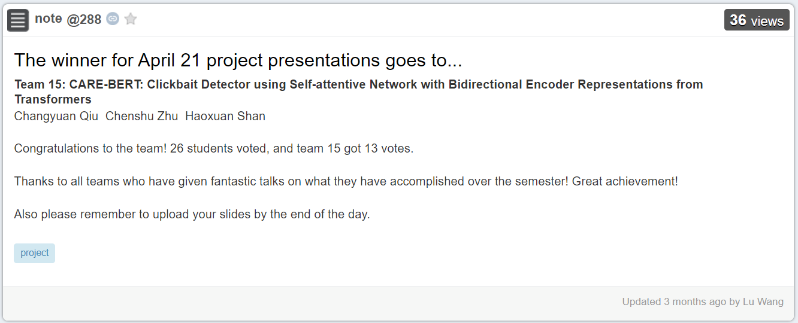

# Click-BERT
Click-BERT: Clickbait Detector with Bidirectional Encoder Representations from Transformers

Course Project for EECS 498 NLP, Winter 2021

Team Members: Changyuan Qiu ([@PeterQiu0516](https://github.com/PeterQiu0516)), Chenshu Zhu ([@Jupiter](https://github.com/jupiterepoch)), Haoxuan Shan ([@shanhx2000](https://github.com/shanhx2000))

## Dataset
We use [Webis 17 Dataset](https://webis.de/data/webis-clickbait-17.html)  for Training and Evaluation.

## Results
* Click-BERT won the best presentation award among 17 teams!

* [Presentation Slides](Presentation/15_Click-BERT%20-%20Clickbait%20Detector%20with%20Bidirectional%20Encoder%20Representations%20from%20Transformers.pdf) released.

* [Final Report](Final-Report/EECS498NLP_Project_Final_Report.pdf) released.
  
* Our baseline2: *headline Bi-LSTM with BERT* achieved new SOTA on accuracy and MSE on Webis 17! Get more details in our [progress report](https://github.com/PeterQiu0516/CARE-BERT/blob/main/Progress-Report/EECS498NLP-Project-Progress-Report.pdf).
